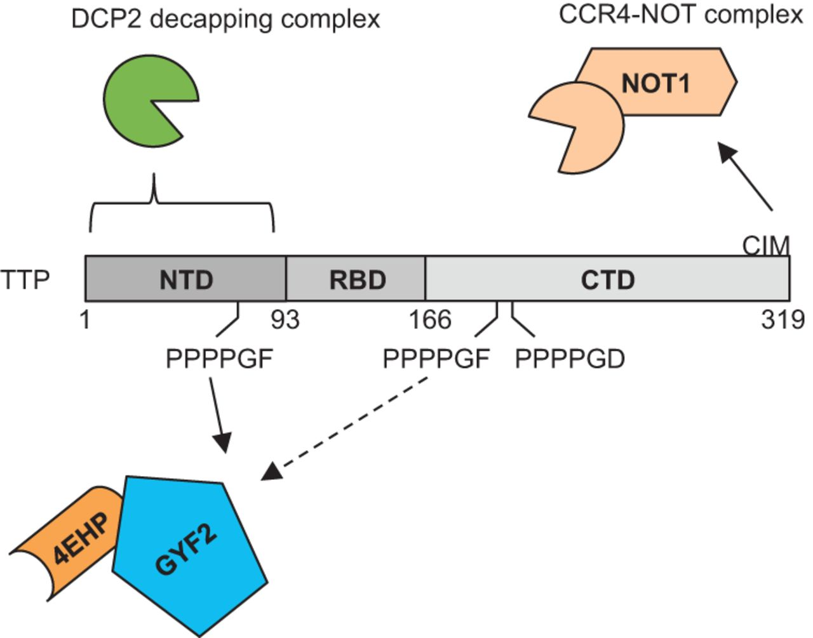
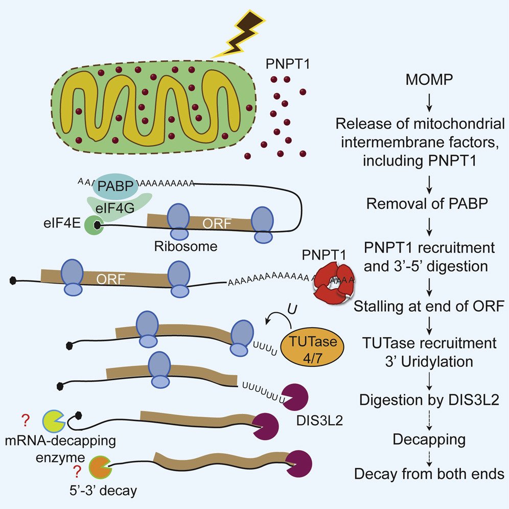
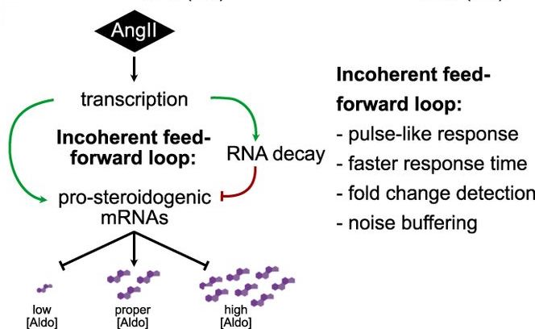

## Rui (Ray), from China

I am currently a semi-independent postdoctoral fellow at the University of Colorado Anschutz Medical Campus [RNA Bioscience Initiative](https://medschool.cuanschutz.edu/rbi), working on genomic and scRNA-seq informatics analyses and software development. My main research interest is gene expression regulation mediated by RNA-binding proteins, especially decay induction and translational repression.

**Full CV**:
[Curriculum Vitae](https://github.com/raysinensis/cv/raw/master/rf_cv.pdf)

**Bioinformatic projects**:

1. [scraps, pipeline for extraction of mRNA polyadenylation sites from "TVN"-primed single-cell RNA-seq libraries](https://github.com/rnabioco/scraps). In prep.
1. [clustifyr, R package for automated single-cell RNA sequencing cluster classification](http://www.bioconductor.org/packages/release/bioc/html/clustifyr.html). F1000Research 2020.
2. [someta, monitoring the issue of missing cell type metadata in NCBI Gene Expression Omnibus single cell sequencing data](https://github.com/rnabioco/someta). PLoS Biology 2021.
3. [squirrelBox, a Shiny browser for hibernating ground squirrel brain and other tissue RNA-seq](https://raysinensis.shinyapps.io/squirrelBox/). Frontiers in Physiology 2020.
4. [TCGAbrowser, data presentation project](http://tcga.raysinensis.com). Data Incubator internship.

**Molecular mechanisms of RNA decay research**:

 

