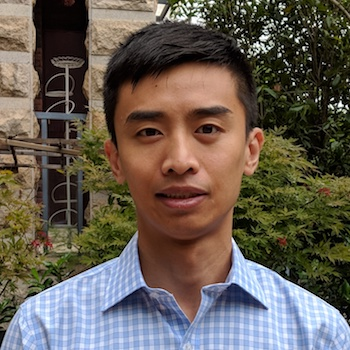

## About me (he/him/his)

I am an RNA biologist and bioinformatician. Originally from China, I finished my PhD at University of California San Diego, and received postdoctoral training at Boston Children's Hospital of Harvard Medical School and University of Colorado Anschutz Medical Campus. Currently, my latest adventures are at the New York Genome center.

I trained in molecular bench experiment research from 2007-2017, mainly in the field of RNA-binding proteins and RNA degradation. Since then, I have worked on coding and computational skills to analyze sequencing and genomic data, still with a focus on RNA.

The current position also gave me more teaching and mentoring opportunities, in both basic biology and bioinformatics, which have been greatly rewarding.

As an RNA Society Featured Spotlight writer, I profile RNA biologists from diverse backgrounds. [Sample1](https://www.rnasociety.org/dr--furqan-fazal); [Sample2](https://www.rnasociety.org/professor-maria-carmo-fonseca)

In my free time, I am an avid reader, blue collar basketball player, cat lover, and frequent volunteer at the local zoo/aquarium/museum, trying to instill my enthusiasm for science into the public.
