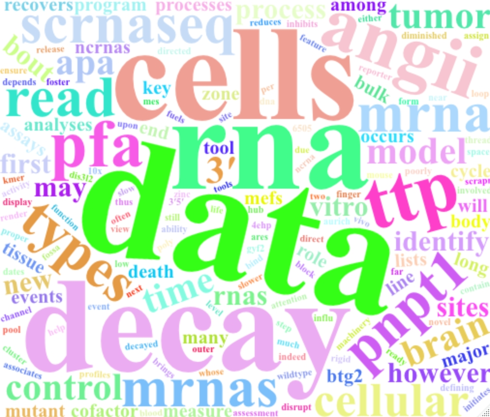

## Research interests

### Post-transcriptional gene expression regulation

Recruitment of the 4EHP-GYF2 cap-binding complex to tetraproline motifs of tristetraprolin promotes repression and degradation of mRNAs with AU-rich elements.  __Fu R__, Olsen MT, Webb K, Bennett EJ, Lykke-Andersen J. _RNA_, 2016. [link](https://rnajournal.cshlp.org/content/22/3/373.full)

PNPT1 release from mitochondria during apoptosis triggers decay of poly(A) RNAs.  Liu X*, __Fu R*__, Pan Y, Meza-Sosa K, Zhang Z, Lieberman J. _Cell_, 2018. [link](https://www.sciencedirect.com/science/article/pii/S0092867418305105)

RNA-binding proteins regulate aldosterone homeostasis in human steroidogenic cells.  **Fu R\***, Wellman K\*, Baldwin A, Rege J, Walters K, Hirsekorn A, Riemondy K, Rainey W, Mukherjee N. _RNA_, 2021. [link](https://rnajournal.cshlp.org/content/27/8/933.full)

Dynamic RNA Regulation in the Brain Underlies Physiological Plasticity in a Hibernating Mammal.  **Fu R\***, Gillen A\*, Grabek K, Riemondy K, Epperson E, Bustamant C, Hesselberth J, Martin S. _Frontiers in Physiology_, 2021. [link](https://www.frontiersin.org/articles/10.3389/fphys.2020.624677/full)

Liver transcriptome dynamics during hibernation are shaped by a shifting balance between transcription and RNA stability.  Gillen A\*, **Fu R\***, Riemondy K\*, Jager J, Fang B, Lazar M, Martin S. _Frontiers in Physiology_, 2021. [link](https://www.frontiersin.org/articles/10.3389/fphys.2021.662132/full)

### Single cell RNA sequencing analysis and software development
clustifyr: an R package for automated single-cell RNA sequencing cluster classification.  __Fu R__, Gillen A, Sheridan R, Tian C, Daya M, Hao Y, Hesselberth J, Riemondy K. _F1000Research_, 2020. [link](https://f1000research.com/articles/9-223)

Cell-level metadata are indispensable for documenting single-cell sequencing datasets. Puntambekar S, Hesselberth J, Riemondy K*, __Fu R*__. _PLoS Biology_, 2021. [link](https://journals.plos.org/plosbiology/article?id=10.1371/journal.pbio.3001077)

Monocytic Subclones Confer Resistance to Venetoclax-Based Therapy in Acute Myeloid Leukemia Patients.  Pei S, Pollyea D, Gustafson A, Stevens B, Minhajuddin M, __Fu R__, Riemondy K, Gillen A, Sheridan R, Kim J, Costello J, Amaya M, Inguva A, Winters A, Ye H, Krug A, Jones C, Adane B, Khan N, Ponder J, Schowinsky J, Abbott D, Hammes A, Myers J, Ashton J, Nemkov T, D’Alessandro A, Gutman J, Fesik S, Ramsey H, Savona M, Smith C, Jordan C. _Cancer Discovery_, 2019. [link](https://cancerdiscovery.aacrjournals.org/content/10/4/536)

Molecular tracking devices quantify antigen distribution and archiving in the murine lymph node.  Walsh S, Sheridan R, Doan T, Lucas E, Ware B, __Fu R__, Burchill M, Hesselberth J, Tamburini B. _eLife_, 2021. [link](https://elifesciences.org/articles/62781)

### [Publication List](https://scholar.google.com/citations?view_op=list_works&hl=en&user=5K4soB0AAAAJ) 

### [Publons Reviews](https://publons.com/researcher/3054442/rui-fu/)

