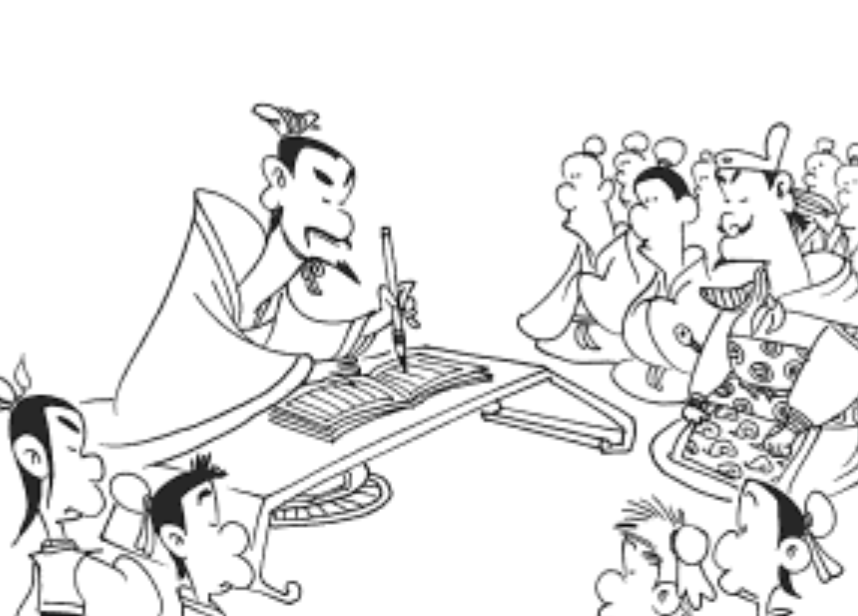

## Teaching and mentoring

> 有教無類 In teaching, there should be no distinction of classes. - Confucius

### Lectures and class material
**Rigor in Research** (2020) - lecture on RNA sequencing

**Foundations in Biomedical Sciences** (2018, 2019, 2020 via Zoom) - lectures, paper discussion, and homework/exam design on RNA biology [Teaching Eval](https://github.com/raysinensis/website/raw/master/Teaching_eval_RuiFu.pdf)

**Practical Data Analysis with R/RStudio** (2018, 2019) - course development and lectures [link](https://rnabioco.github.io/practical-data-analysis)

**Workshop for scRNA-seq Data Analysis** (2019, 2020 via RStudio Cloud, 2021) - course development and online lectures [link](https://rnabioco.github.io/cellar)

### Teaching training
**Inclusive STEM Teaching Course** [link](https://www.inclusivestemteaching.org)

**Harvard Medical School Scientists Teaching Science Course** [link](https://postdoc.hms.harvard.edu/STS-course)

### Mentoring
**2020 - 2021:** Remote mentoring of AAPI undergraduate computer science student, systemically exploring published scRNA-seq cell type signatures in the NCBI Gene Expression Omnibus. Mentee's work was integrated into a first-author publication, and recent updates to R Bioconductor packages *clustifyr* and *clustifyrdatahub*.

**2017:** Mentoring of high school student enrolled in the MIT Research Science Institute program on tissue culture, RNA-related bench experiments, RNA-seq informatics analysis, and scientific writing. Also facilitated mentee's research exchange experience in China.

**2013 - 2015:** Mentoring of student research spanning undergraduate honor thesis and master thesis on biochemical investigations of RNA-binding protein functions. Mentee was awarded Best Poster Presentation Award at 2014 UCSD Biological Sciences Annual Student Research Showcase, and her work was integrated into second-author publication. Mentee is now in medical school.

### Science outreach volunteering

**2019 - 2020:** Facilitator at Denver Museum of Nature and Science - Prehistoric Journey section

**2016 - 2017:** Visitor Education Volunteer at the New England Aquarium

**2015 - 2016:** Information Ambassador at the San Diego Zoo

**2012:** Organizer for UCSD Ethics Center’s Silent Spring 50th Anniversary Project
